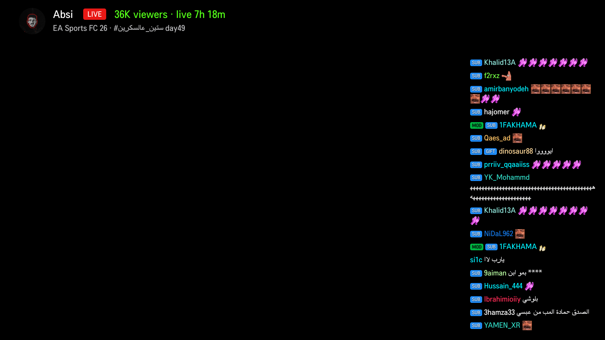
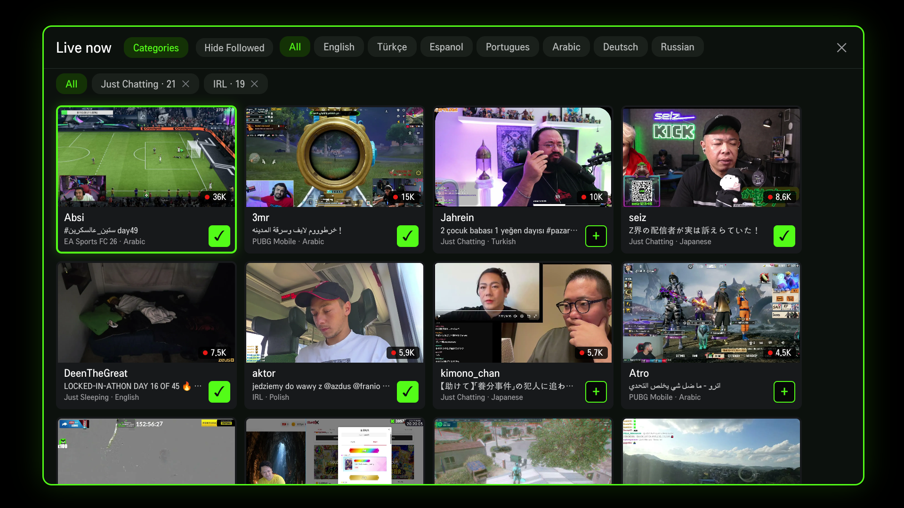
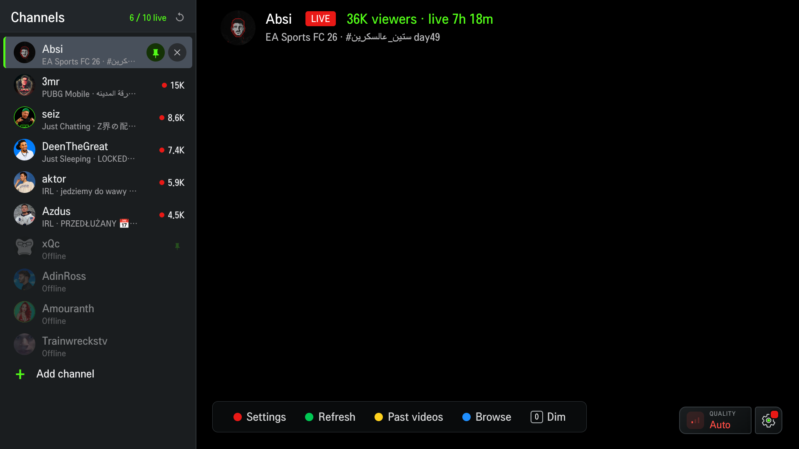
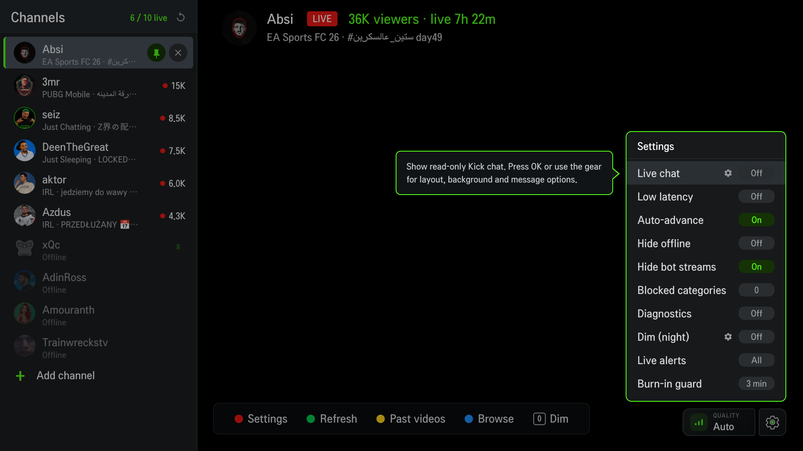

# Kick TV (Unofficial) for LG webOS

Watch Kick livestreams on an LG webOS TV. It opens on your last stream and keeps
your channels in a sidebar. No sign-in. You get live status, viewer counts,
pinning, a live channel browser with categories, past videos (VODs), an optional
read-only chat overlay with real Kick emotes and badges, quality options, low
latency, and auto-advance to the next live channel.

This is an unofficial personal project. It is not affiliated with or endorsed by
Kick, and it reads Kick's public web endpoints, so it can break if Kick changes
something. Use it at your own risk.

## Screenshots

<table>
<tr>
<td width="50%"></td>
<td width="50%"></td>
</tr>
<tr>
<td align="center">Player with the read-only live chat overlay</td>
<td align="center">Browse everything live, filter by language</td>
</tr>
<tr>
<td width="50%"></td>
<td width="50%"></td>
</tr>
<tr>
<td align="center">Your channels, live ones first, with pins</td>
<td align="center">Settings: chat, low latency, auto-advance, quality</td>
</tr>
</table>

The video looks black in these shots because webOS draws the stream on a
hardware layer that screen captures cannot grab. On the TV it plays normally
behind the interface.

## Install

LG does not allow apps like this in the Content Store, so you sideload it in
Developer Mode.

### 1. Turn on Developer Mode

1. Make a free account at https://developer.lge.com. You sign in with it on the
   TV too.
2. On the TV, install "Developer Mode" from the Content Store, open it, and sign
   in.
3. Turn on Dev Mode Status and let the TV restart.
4. Open Developer Mode again. Note the TV's IP address, and turn on Key Server to
   get a short passphrase.

Developer Mode turns off after about 50 hours. Turn on auto renew if you want it
to stay on. If it expires, your sideloaded apps disappear, so just enable it
again and reinstall.

### 2. Install the app

The easy way, no command line: download the latest `.ipk` from the
[Releases](../../releases) page and install it with
[webOS Dev Manager](https://github.com/webosbrew/dev-manager-desktop), a point
and click tool. Add your TV with its IP and passphrase from step 1, then install
the file.

Prefer the command line, or want to build it yourself? You need Node.js and the
webOS CLI:

```
npm install -g @webos-tools/cli
ares-setup-device --add tv --info "host=YOUR_TV_IP" --info "port=9922" --info "username=prisoner"
ares-package ./app ./services/com.barisahmet.kicktv.service -o .
ares-install --device tv com.barisahmet.kicktv_1.0.0_all.ipk
```

Launch it from the TV home screen, or with
`ares-launch --device tv com.barisahmet.kicktv`.

If the install fails with `isDate is not a function`, that is a known bug in the
webOS CLI on recent Node.js versions, not your setup. Either use webOS Dev
Manager instead, or preload a tiny shim:

```
// shim.js
const util = require('util');
if (!util.isDate) util.isDate = (d) => Object.prototype.toString.call(d) === '[object Date]';
```

```
NODE_OPTIONS="--require ./shim.js" ares-install --device tv com.barisahmet.kicktv_1.0.0_all.ipk
```

## Using it

- First launch has no channels. Add one by its Kick name and it shows up in the
  list.
- After that it opens on your last channel if it is live.
- Move the pointer or press left or right to open the channel list. It hides
  again after a few seconds.
- Click a live channel to watch. Hover one for the pin and remove buttons.
  Pinned channels sit at the top while they are live.
- Click an offline channel, or press the yellow button while watching, to see
  that channel's past videos (VODs).
- The blue button opens the live channel browser. Inside it, the yellow button
  (or the Categories button) lets you browse by category.
- The gear at the bottom right, or the red button, opens Settings: chat, low
  latency, auto-advance, and quality.
- Press Back once for an exit prompt, Back again to close.

Your channels are saved on the TV only. The public build ships with none.

## How it works

A webOS page cannot call kick.com directly, and Kick blocks the TV's default
requests. So the app includes a small background service that fetches Kick's
data for it and hands the stream to the TV's player. It is bundled in the same
package, nothing to set up.

## License

MIT, see LICENSE. Bundles hls.js, which has its own license
(see THIRD_PARTY_LICENSES.md).
